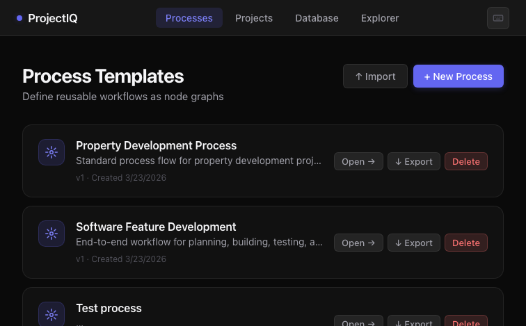
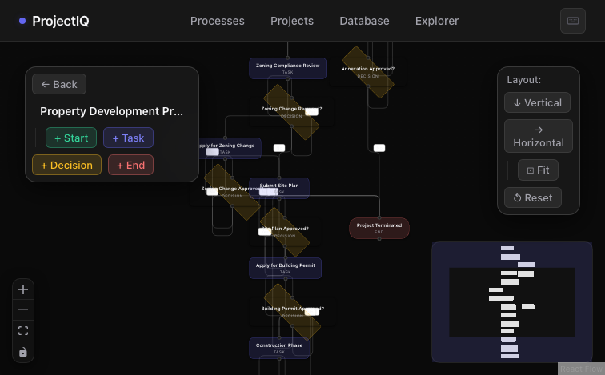
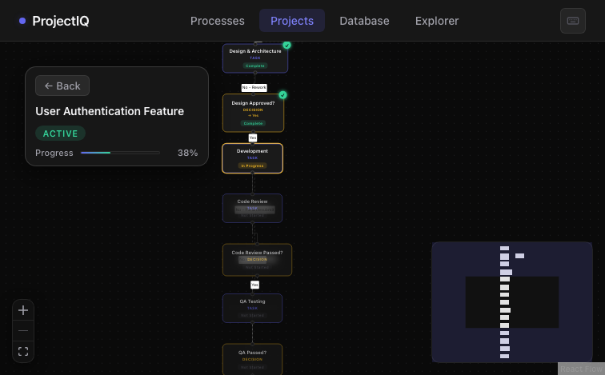
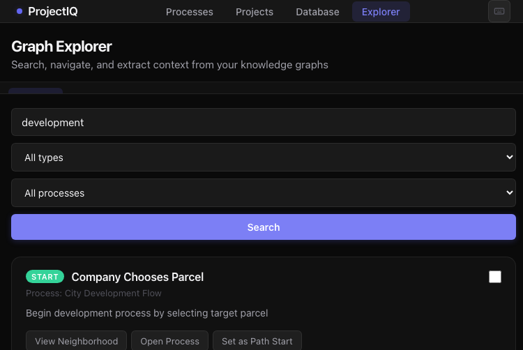
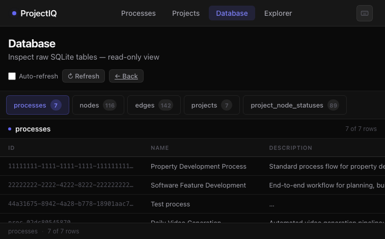

# ProjectIQ

**AI-powered project intelligence dashboard.** Model and track complex processes as interactive knowledge graphs — with built-in Graph RAG for LLM/IDE integration.

> Internal tool and portfolio piece. Private repo.

---

## What It Does

ProjectIQ lets you define reusable process templates as directed graphs, then instantiate and track projects through those templates. Decisions are captured at each branch point, form data is collected per-node, and the full graph is queryable by LLMs via Graph RAG or MCP.

**Think:** flowchart editor + project tracker + knowledge graph, in one Apple dark mode UI.

---

## Features

### Process Authoring
- Visual drag-and-drop graph editor (React Flow)
- Node types: `start`, `task`, `decision`, `end`
- Draggable orthogonal edges with rounded corners
- Form schema builder per node (capture structured data)
- Export/import process templates as JSON

### Project Tracking
- Instantiate projects from process templates
- Track node status: Not Started → In Progress → Complete
- Capture decision outcomes at branch points
- Full audit trail of edge traversals
- Export/import project state as JSON

### Graph RAG
- Full-text search across all process nodes
- Neighborhood exploration (N hops)
- Path finding between any two nodes
- Subgraph extraction (upstream/downstream)
- Context builder for RAG pipelines
- Export formats: JSON, Markdown, Graphviz DOT, Mermaid, LLM-optimized context

### MCP Server
- 8 tools for Claude/LLM integration
- Resource browsing for processes and projects
- Drop-in config for Claude Desktop

### UI Polish
- Apple dark mode design system throughout
- Toast notifications + loading skeletons
- Onboarding banner for new users
- Mobile-responsive header with hamburger nav
- Rich demo seed data (Software Feature Development process)

---


## Screenshots

### Process Templates
Browse and manage reusable workflow templates.



### Process Editor
Visual drag-and-drop graph editor with node types and edge routing.



### Project Tracker
Track active projects against process templates with node-by-node status.



### Graph Explorer
Full-text search, neighborhood exploration, and context building across all knowledge graphs.



### Database Viewer
Inspect raw SQLite tables — useful for debugging and auditing.



## Tech Stack

| Layer | Technology |
|-------|------------|
| Frontend | React 18 + TypeScript + React Flow + Vite |
| Backend | Node.js + Express + TypeScript |
| Database | SQLite (better-sqlite3) |
| MCP | Model Context Protocol server |
| Containers | Docker + Docker Compose |

---

## Quick Start

### Option 1: Docker

```bash
git clone https://github.com/14-TR/Know-Flow.git projectiq
cd projectiq
docker-compose up --build
```

- Frontend: http://localhost:5173
- API: http://localhost:3001/api

### Option 2: Local Development

```bash
# Backend
cd api && npm install && npm run dev
# → http://localhost:3001

# Frontend (new terminal)
cd client && npm install && npm run dev
# → http://localhost:5173
```

---

## Project Structure

```
projectiq/
├── api/                    # Express + TypeScript backend
│   ├── src/
│   │   ├── routes/         # REST endpoints
│   │   │   └── graphRag.ts # Graph RAG API
│   │   ├── utils/          # DB connection
│   │   └── index.ts
│   └── ...
├── client/                 # React + Vite frontend
│   ├── src/
│   │   ├── components/     # Shared UI components
│   │   ├── pages/          # Route-level pages
│   │   ├── services/       # API client
│   │   └── styles/         # Global CSS design system
│   └── ...
├── mcp-server/             # MCP server for LLM integration
│   └── ...
├── database/               # SQLite schema + seed data
│   ├── schema.sql
│   └── seed.sqlite.sql
└── docker-compose.yml
```

---

## API Reference

### Processes
| Method | Endpoint | Description |
|--------|----------|-------------|
| GET | `/api/processes` | List all processes |
| GET | `/api/processes/:id` | Get process + graph |
| POST | `/api/processes` | Create process |
| PUT | `/api/processes/:id` | Update process |
| DELETE | `/api/processes/:id` | Delete process |
| GET  | `/api/processes/:id/export` | Export as JSON |
| POST | `/api/processes/import` | Import from JSON |

### Projects
| Method | Endpoint | Description |
|--------|----------|-------------|
| GET | `/api/projects` | List all projects |
| GET | `/api/projects/:id` | Get project + status |
| POST | `/api/projects` | Create from template |
| PUT | `/api/projects/:id` | Update project |
| DELETE | `/api/projects/:id` | Delete project |
| GET  | `/api/projects/:id/export` | Export as JSON |
| POST | `/api/projects/import` | Import from JSON |

### Graph RAG
| Method | Endpoint | Description |
|--------|----------|-------------|
| GET | `/api/graph/search` | Search nodes by text |
| GET | `/api/graph/process/:id/context` | Full process context |
| GET | `/api/graph/node/:id/neighborhood` | Node + N-hop neighbors |
| GET | `/api/graph/node/:id/paths-to/:targetId` | Paths between nodes |
| GET | `/api/graph/process/:id/subgraph` | Extract subgraph |
| POST | `/api/graph/context/build` | Custom context from node IDs |
| GET | `/api/graph/processes/summary` | Process stats |
| GET | `/api/graph/project/:id/history` | Execution history |
| GET | `/api/graph/export/process/:id` | Export (json/md/dot/mermaid/llm-context) |

---

## MCP Server

Connect ProjectIQ to Claude or any MCP-compatible LLM:

```bash
cd mcp-server && npm install && npm run build
```

Add to `~/.claude/claude_desktop_config.json`:

```json
{
  "mcpServers": {
    "projectiq": {
      "command": "node",
      "args": ["/path/to/projectiq/mcp-server/dist/index.js"],
      "env": {
        "KNOWFLOW_DB_PATH": "/path/to/projectiq/api/data/knowflow.db"
      }
    }
  }
}
```

### Available MCP Tools

| Tool | Description |
|------|-------------|
| `search_graph` | Search nodes by title/description |
| `get_process_context` | Full context of a process |
| `get_node_neighborhood` | Connected nodes up to N hops |
| `find_paths` | All paths between two nodes |
| `get_subgraph` | Extract subgraph from starting nodes |
| `list_processes` | List all processes |
| `get_project_history` | Project execution history + decisions |
| `list_projects` | List all project instances |

---

## Team Deployment

Share process templates across a team via a network share. Admin writes templates; users access them read-only.

```
Network Share
└── admin/
    └── knowflow.db        # Shared templates (read-only)

User Machine
└── data/
    └── knowflow.db        # Local projects
```

Set environment variables:

```bash
# Admin
DATA_DIR=/mnt/shared/projectiq KNOWFLOW_USER=admin docker-compose up --build

# User .env
KNOWFLOW_USER=alice
ADMIN_SHARE_PATH=/mnt/shared/projectiq/admin
```

Network share paths:
- **Windows**: `\\SERVER\ProjectIQ\admin`
- **Mac**: `/Volumes/ProjectIQ/admin`
- **Linux**: `/mnt/shared/projectiq/admin`

---

## Environment Variables

| Variable | Default | Description |
|----------|---------|-------------|
| `PORT` | 3001 | Backend API port |
| `DATA_DIR` | `./data` | User data directory |
| `ADMIN_DATA_DIR` | `DATA_DIR/admin` | Shared templates path |
| `KNOWFLOW_USER` | `admin` | Username (admin = template edit) |
| `NODE_ENV` | development | Environment mode |
| `VITE_API_URL` | `http://localhost:3001/api` | API URL for frontend |

---

## Development

```bash
# Backend
cd api
npm run dev          # Dev server with hot reload
npm run build        # Compile TypeScript
npm run typecheck    # Type check only

# Frontend
cd client
npm run dev          # Vite dev server
npm run build        # Production build
npm run typecheck    # Type check only

# MCP Server
cd mcp-server
npm run dev          # tsx dev mode
npm run build        # Compile TypeScript
```

---

## Database Schema

| Table | Purpose |
|-------|---------|
| `processes` | Process templates |
| `nodes` | Graph nodes per process |
| `edges` | Connections between nodes |
| `projects` | Project instances |
| `project_node_statuses` | Per-project node tracking |
| `project_edge_traversals` | Audit trail |

Reset the database:

```bash
# Docker
docker-compose down -v && docker-compose up --build

# Local
rm api/data/knowflow.db && npm run dev  # in api/
```

---

## Changelog

See [CHANGELOG.md](CHANGELOG.md) for release history.

## License

MIT
